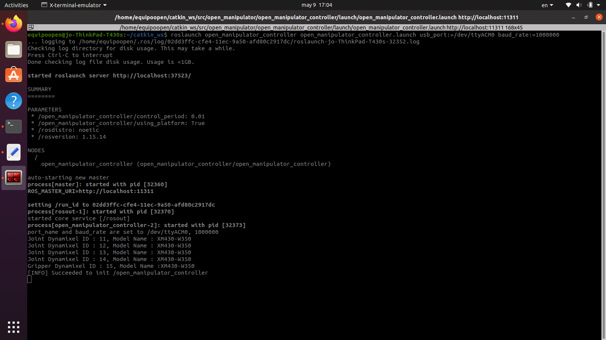
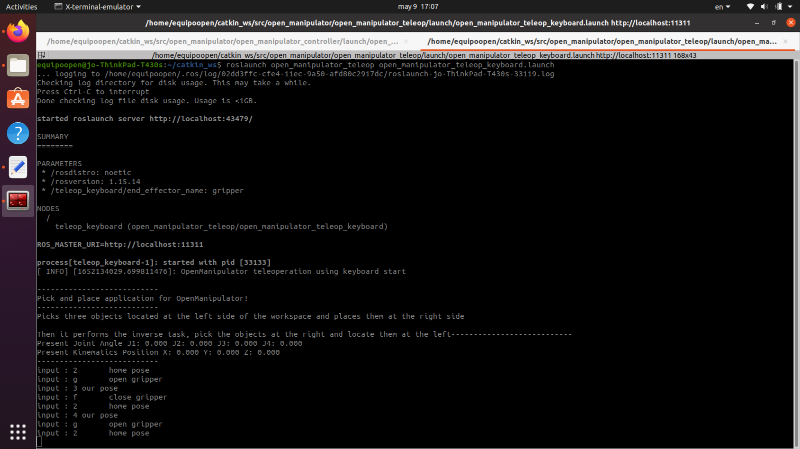

<div id="top"></div>
<br />
<div align="center">
  <a href="github.com/JosueLara22/PicknPlace-for-Open_Manipulator">
    
  </a>

<h3 align="center">PicknPlace-for-Open_Manipulator</h3>

  <p align="center">
    Pick and place implementation for the Open Manipulator X robot
    <br />
    <a href="https://github.com/JosueLara22/PicknPlace-for-Open_Manipulator"><strong>Explore the docs »</strong></a>
    <br />
  </p>
</div>


## About The Project
This is a pick and place implementation for the Open Manipulator X robot using Ubutntu 20.04, ROS Noetic and the keyboard teleoperation tutorial as the foundation.
### Built With
* The base of the project is found in the Open Manipulator X teleoperation tutorial. 
* Link for the original project https://emanual.robotis.com/docs/en/platform/openmanipulator_x/quick_start_guide/
* The repository of the original project link 
https://github.com/ROBOTIS-GIT/open_manipulator/tree/master/open_manipulator_teleop
* Wiki ros tutorials available at http://wiki.ros.org/ROS/Tutorials

Project for the Kinematics and Dynamics of Robots course at the Universidad de las Americas Puebla

<!-- TABLE OF CONTENTS -->
<details>
  <summary>Table of Contents</summary>
  <ol>
    <li>
      <a href="#about-the-project">About The Project</a>
      <ul>
        <li><a href="#built-with">Built With</a></li>
      </ul>
    </li>
    <li>
      <a href="#getting-started">Getting Started</a>
      <ul>
        <li><a href="#prerequisites">Prerequisites</a></li>
        <li><a href="#installation">Installation</a></li>
      </ul>
    </li>
    <li><a href="#usage">Usage</a></li>
    <li><a href="#contact">Contact</a></li>
  </ol>
</details>

## Getting Started

<p align="right">(<a href="#top">back to top</a>)</p>

### Prerequisites
For the implementation you will need Ubuntu 20.04 on your computer.
### Installation
1. Install ROS Noetic: User must be admin to proceed
2. Install Github
```sh 
 sudo apt-get install git-all
```
3. Install ROS Noetic tools (Copy all these instructions on terminal)
```sh 
sudo apt update 
wget https://raw.githubusercontent.com/ROBOTIS-GIT/robotis_tools/master/install_ros_noetic.sh
chmod 755 ./install_ros_noetic.sh
bash ./install_ros_noetic.sh
```  
4. Install controllers and pakages
```sh
source ~/.bashrc	 
sudo apt-get install ros-noetic-ros-controllers ros-noetic-gazebo* ros-noetic-moveit* ros-noetic-industrial-core	 
sudo apt install ros-noetic-dynamixel-sdk ros-noetic-dynamixel-workbench*
sudo apt install ros-noetic-robotis-manipulator
```
5. Install Open Manipulator Pakages
```sh
cd ~/catkin_ws/src/
git clone -b noetic-devel https://github.com/ROBOTIS-GIT/open_manipulator.git
git clone -b noetic-devel https://github.com/ROBOTIS-GIT/open_manipulator_msgs.git
git clone -b noetic-devel https://github.com/ROBOTIS-GIT/open_manipulator_simulations.git
git clone https://github.com/ROBOTIS-GIT/open_manipulator_dependencies.git
```
6. Remove original file	
```sh
cd ~/catkin_ws/src/open_manipulator/open_manipulator_teleop/src/
rm open_manipulator_teleop_keyboard.cpp
git clone https://github.com/JosueLara22/PicknPlace-for-Open_Manipulator.git
cd PicknPlace-for-Open_Manipulator/open_manipulator_teleop/src/
mv open_manipulator_teleop_keyboard.cpp ~/catkin_ws/src/open_manipulator/open_manipulator_teleop/src/
cd ~/catkin_ws/src/open_manipulator/open_manipulator_teleop/src/
rm -rf PicknPlace-for-Open_Manipulator	
cd ~/catkin_ws && catkin_make
clear
```
7. Run communication with Robot
```sh
roslaunch open_manipulator_controller open_manipulator_controller.launch usb_port:=/dev/ttyACM0 baud_rate:=1000000
```
When the communication launch command is run, an overview of the parameters and nodes that are recognized by ROS is displayed. Then the Dynamixel motors are listed with their ID and model, as well as showing that the communication was successfully initiated.
Below is a screenshot of the communication instruction execution.

   <br />
<div align="center">
  <a href="github.com/JosueLara22/PicknPlace-for-Open_Manipulator">

  </a>
</div>
<br />

8. Run file Pick and Place (in new Tab)
```sh
roslaunch open_manipulator_teleop open_manipulator_teleop_keyboard.launch
```
When executing the launch program, an overview of parameters and nodes is displayed in a similar way as in the communication instruction.
Subsequently, a short description of what the robot does, the angles of each joint and the position of the end effector is shown.
It then displays the moves it makes, being 1-8 displacement moves, g the gripper opening and f the gripper closing.
Below is a screenshot of the execution of the statement with the termination .launch.

  <br />
<div align="center">
  <a href="github.com/JosueLara22/PicknPlace-for-Open_Manipulator">

  </a>
</div>
<br />

## Usage

<p align="right">(<a href="#top">back to top</a>)</p>

Video link: [Implementation video](https://winliveudlap-my.sharepoint.com/:v:/g/personal/sarah_vasquezmo_udlap_mx/EaZCbYp65i5FrppyspDonGIB5Cu1J3-BTYYwI4DeImPdMg?e=WbegII)
<br />
<div align="center">
  <a href="https://user-images.githubusercontent.com/105239023/167538435-419e82dc-3050-4f19-b23e-4a53e5203ad2.png">
    
  </a>
</div>
<br />

## Modifications to the original project.
The robotis project was taken as a basis for the teleoperation of the robot through the computer keyboard mentioned above.
In the main file named "open_manipulator_teleop_keyboard.cpp" located in the /open_manipulator/open_manipulator_teleop/src/ folder, the instructions that command the robot's movements were found, determined by a case in which each character or option sent the robot different positions of the joints.
What was changed from the original project is this file, where the joint positions were changed to those that described the team's pick and place implementation.
The description that is shown in the console when executing the launch program was also modified so that it sent the positions of the joints, the location of the grippper and a small description of the program along with the movement that it was executing.
The program was also modified so that, instead of waiting for the user's response sent through the keyboard, the characters were set in the main program.
The change of these aspects resulted in the modification of the following functions:
- void OpenManipulatorTeleop::setGoal(char ch) 
- void OpenManipulatorTeleop::printText()
- int main(int argc, char **argv)

## Contact

<p align="right">(<a href="#top">back to top</a>)</p>

Project Link: [github.com/JosueLara22/PicknPlace-for-Open_Manipulator](github.com/JosueLara22/PicknPlace-for-Open_Manipulator)
## Enjoy, have fun and improve the program!
